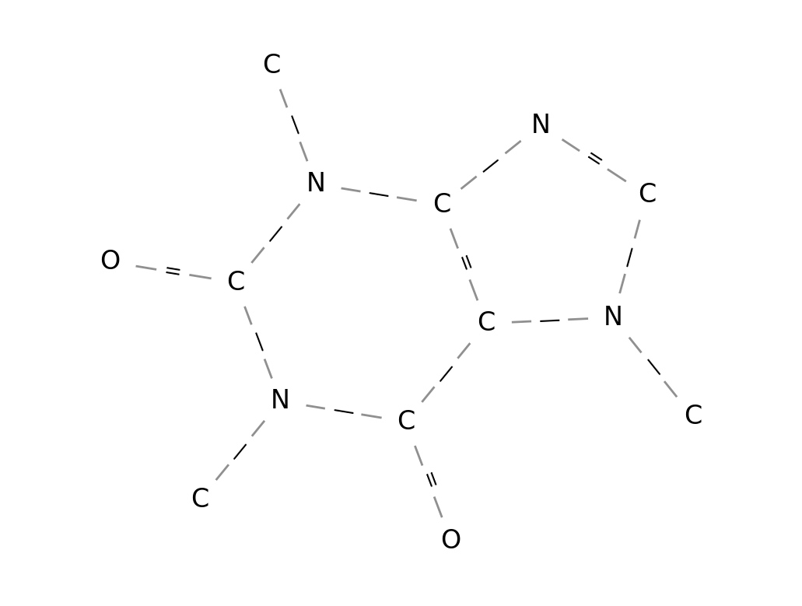
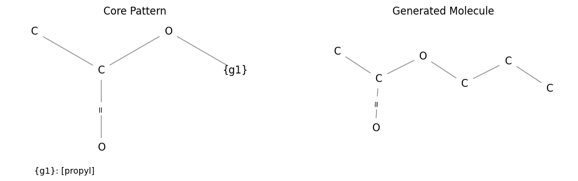
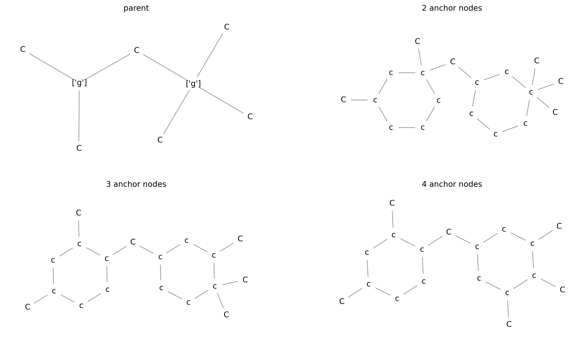
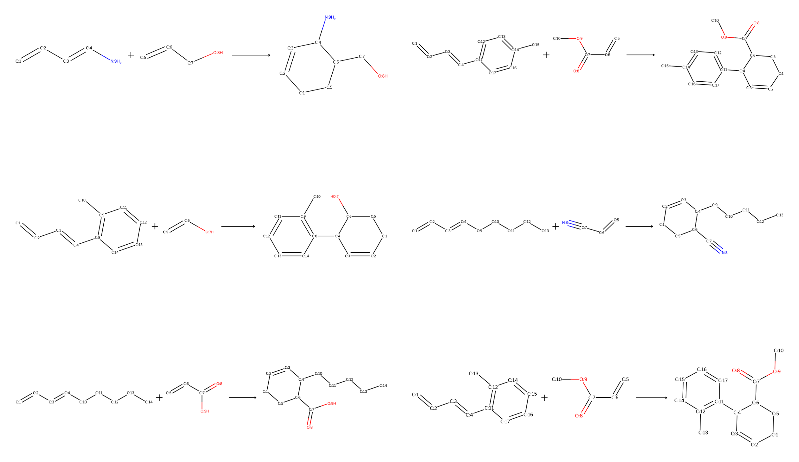

============
Graph Syntax
============

FGUtils has its own graph description language. The syntax is closely related
to the SMILES format for molecules and reactions. It is kind of an extenstion
to SMILES to support modeling ITS graphs and reaction patterns. To convert the
SMILES-like description into a graph object use the
:py:class:`~fgutils.parse.Parser` class. The Caffeine molecular graph can be
obtained as follows::

    import matplotlib.pyplot as plt
    from fgutils import Parser
    from fgutils.vis import plot_as_mol

    parser = Parser()
    mol = parser("CN1C=NC2=C1C(=O)N(C(=O)N2C)C")

    fig, ax = plt.subplots(1, 1)
    plot_as_mol(mol, ax)
    plt.show()

Besides parsing common SMILES it is possible to generate molecule-like graphs
with more abstract nodes, i.e., arbitrary node labels. Arbitrary node labels
are surrounded by ``{}`` (e.g. ``{label}``). This abstract labeling can be used
to substitute nodes with specific patterns. In this context the labels are
group names of :py:class:`~fgutils.proxy.ProxyGroup` objects. A ProxyGroup
defines a set of sub-graphs to be replaced for the labeled node. This can be
done by using a :py:class:`~fgutils.proxy.Proxy`. Propyl acetate can be created
by replacing the labeled node with the propyl group::

    import matplotlib.pyplot as plt
    from fgutils import Parser
    from fgutils.proxy import MolProxy, ProxyGroup
    from fgutils.vis import plot_graph

    pattern = "CC(=O)O{propyl}"
    propyl_group = ProxyGroup("propyl", pattern="CCC")
    parser = Parser()
    proxy = MolProxy(pattern, propyl_group, parser=parser)

    g = parser(pattern)
    mol = next(proxy)

    fig, ax = plt.subplots(1, 2, dpi=100, figsize=(12, 4))
    plot_graph(g, ax[0], show_labels=True)
    plot_graph(mol, ax[1])
    plt.show()

.. note:: 

   A node can have more than one label. This can be done by separating the
   labels with a comma, e.g.: ``{label_1,label_2}``.

In the example above the ProxyGroup has only one subgraph pattern. In general,
a ProxyGroup is a collection of several possible subgraphs from which one is
selected when a new sample is instantiated (currently only random selection is
implemented). By default a pattern has one anchor at index 0. If you need more
control over how a subgraph is inserted into a parent graph you can instantiate
the :py:class:`~fgutils.proxy.ProxyGraph` class. For a ProxyGraph you can
provide a list of anchor node indices. The insertion of the subgraph into the
parent depends on the number of anchor nodes in the subgraph and the number of
edges to the labeled node in the parent. The first edge in the parent connects
to the first anchor node in the subgraph and so forth. The following example
demonstrates the insertion with multiple anchor nodes::

    import matplotlib.pyplot as plt
    from fgutils.proxy import MolProxy, ProxyGroup, ProxyGraph, Parser
    from fgutils.vis import plot_graph

    pattern = "C{g}(C)C{g}(C)(C)C"
    g_2 = ProxyGroup("g", ProxyGraph("c1ccccc1", anchor=[1, 3]))
    g_3 = ProxyGroup("g", ProxyGraph("c1ccccc1", anchor=[1, 3, 4]))
    g_4 = ProxyGroup("g", ProxyGraph("c1ccccc1", anchor=[1, 3, 4, 5]))

    parser = Parser()
    proxy1 = MolProxy(pattern, g_2)
    proxy2 = MolProxy(pattern, g_3)
    proxy3 = MolProxy(pattern, g_4)

    parent_graph = parser(pattern)
    mol1 = next(proxy1)
    mol2 = next(proxy2)
    mol3 = next(proxy3)

    fig, ax = plt.subplots(2, 2, dpi=200, figsize=(16, 9))
    plot_graph(
        parent_graph, ax[0, 0], show_labels=True, show_edge_labels=False, title="parent"
    )
    plot_graph(mol1, ax[0, 1], show_edge_labels=False, title="2 anchor nodes")
    plot_graph(mol2, ax[1, 0], show_edge_labels=False, title="3 anchor nodes")
    plot_graph(mol3, ax[1, 1], show_edge_labels=False, title="4 anchor nodes")
    plt.show()

Another extension to the SMILES notation is the encoding of bond changes. This
feature is required to model reaction mechanisms as ITS graph. Changing bonds
are surrounded by ``<>`` (e.g. ``<1, 2>`` for the formation of a double bond
from a single bond). The extended notation allows the automated generation of
reaction examples with complete atom-to-atom maps. The following code snippet
demonstrates the generation of a few Diels-Alder reactions. The ``diene`` and
``dienophile`` groups can of course be extended to increase varaity of the
samples::

    import matplotlib.pyplot as plt
    from fgutils.proxy import ProxyGroup, ProxyGraph, ReactionProxy
    from fgutils.proxy_collection.common import common_groups
    from fgutils.vis import plot_reaction

    electron_donating_group = ProxyGroup(
        "electron_donating_group", pattern="{alkyl,aryl,amine}"
    )
    electron_withdrawing_group = ProxyGroup(
        "electron_withdrawing_group",
        pattern="{alkohol,ether,aldehyde,ester,nitrile}",
    )
    diene_group = ProxyGroup(
        "diene",
        ProxyGraph("C<2,1>C<1,2>C<2,1>C{electron_donating_group}", anchor=[0, 3]),
    )
    dienophile_group = ProxyGroup(
        "dienophile",
        ProxyGraph("C<2,1>C{electron_withdrawing_group}", anchor=[0, 1]),
    )
    groups = common_groups + [
        electron_donating_group,
        electron_withdrawing_group,
        diene_group,
        dienophile_group,
    ]

    proxy = ReactionProxy("{diene}1<0,1>{dienophile}<0,1>1", groups)

    r, c = 3, 2
    fig, ax = plt.subplots(r, c, dpi=400)
    for ri in range(r):
        for ci in range(c):
            g, h = next(proxy)
            ax[ri, ci].axis("off")
            plot_reaction(g, h, ax[ri, ci])
    plt.tight_layout()
    plt.show()

.. note::

   The ``electron_donating_group`` and ``electron_withdrawing_group`` serve as
   a collection of other groups to simplify the notation. They consist of a
   single node with multiple labels. When iterating the next sample from the
   proxy (``next(proxy)``) the labeled nodes get replaced by the pattern from
   one of the groups. The group/label is chosen randomly with uniform
   distribution.

